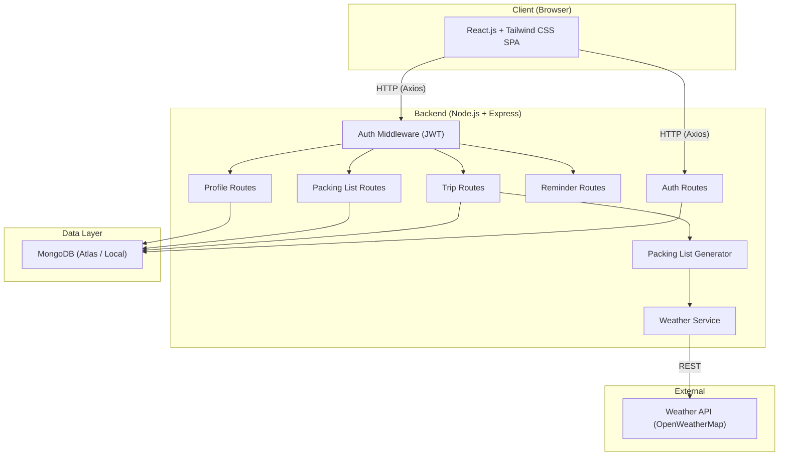
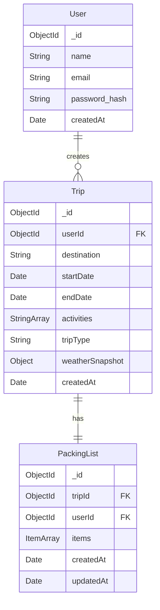
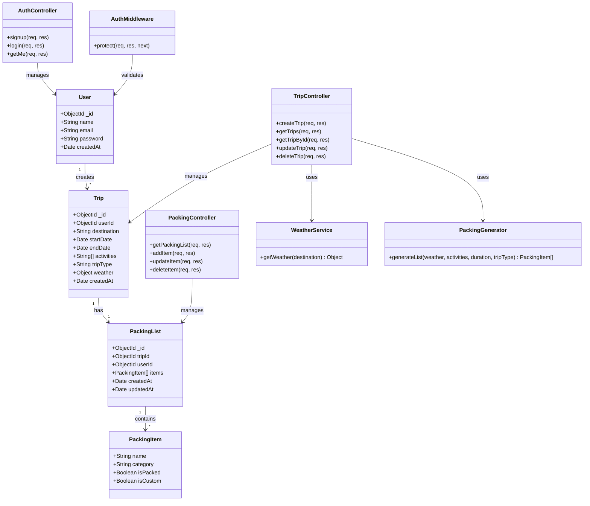

# Smart Travel Planner -- Project Execution Plan

### Team
- **Person A (Backend):** Reenu Biju -- APIs, database schema, authentication, business logic, weather integration, packing list generation
- **Person B (Frontend):** Radhika -- UI, React components, pages, forms, API integration, styling with Tailwind

---

## 1. System Architecture



### Key Architectural Decisions
- **Monorepo** with `/client` and `/server` at root -- single GitHub repo, avoids syncing two repos.
- **JWT-based auth** -- stateless, simple to implement, stored in localStorage on the client.
- **OpenWeatherMap free tier** -- sufficient for MVP (1,000 calls/day).
- **Packing list generator** -- rule-based engine on the backend that takes weather + activities + trip duration as input and outputs a suggested item list.
- **Weather data is a snapshot, not a forecast** -- OpenWeatherMap free tier provides current weather and 5-day forecasts. For trips further out, the snapshot is illustrative. The packing generator uses temperature ranges and general climate rather than exact forecasts. A future improvement could re-fetch weather when the trip falls within the 5-day forecast window.

---

## 2. Folder Structure

```
smart_traveler_plan/
├── client/                     # React frontend (Radhika)
│   ├── public/
│   │   └── index.html
│   ├── src/
│   │   ├── api/                # Axios instance & API call helpers
│   │   │   └── axios.js
│   │   ├── components/         # Reusable UI components
│   │   │   ├── Navbar.jsx
│   │   │   ├── Footer.jsx
│   │   │   ├── ProtectedRoute.jsx
│   │   │   ├── WeatherCard.jsx
│   │   │   ├── PackingItem.jsx
│   │   │   └── TripCard.jsx
│   │   ├── pages/              # Route-level pages
│   │   │   ├── Home.jsx
│   │   │   ├── Login.jsx
│   │   │   ├── Signup.jsx
│   │   │   ├── Dashboard.jsx
│   │   │   ├── CreateTrip.jsx
│   │   │   ├── TripDetails.jsx
│   │   │   ├── PackingList.jsx
│   │   │   └── Profile.jsx
│   │   ├── context/            # React Context (Auth)
│   │   │   └── AuthContext.jsx
│   │   ├── hooks/              # Custom hooks
│   │   ├── utils/              # Helper functions
│   │   ├── App.jsx
│   │   ├── index.js
│   │   └── index.css           # Tailwind directives
│   ├── tailwind.config.js
│   ├── postcss.config.js
│   └── package.json
│
├── server/                     # Express backend (Reenu Biju)
│   ├── config/
│   │   └── db.js               # MongoDB connection
│   ├── controllers/
│   │   ├── authController.js
│   │   ├── tripController.js
│   │   ├── packingController.js
│   │   ├── reminderController.js
│   │   └── profileController.js
│   ├── models/
│   │   ├── User.js
│   │   ├── Trip.js
│   │   └── PackingList.js
│   ├── routes/
│   │   ├── authRoutes.js
│   │   ├── tripRoutes.js
│   │   ├── packingRoutes.js
│   │   ├── reminderRoutes.js
│   │   └── profileRoutes.js
│   ├── middleware/
│   │   ├── authMiddleware.js
│   │   └── errorHandler.js
│   ├── services/
│   │   ├── weatherService.js
│   │   └── packingGenerator.js
│   ├── utils/
│   │   └── packingRules.js     # Item rules/data for generator
│   ├── .env
│   ├── .env.example            # Placeholder env vars (committed to repo)
│   ├── server.js               # Entry point
│   └── package.json
│
├── .gitignore
└── README.md
```

Reenu Biju works almost exclusively inside `/server`. Radhika works almost exclusively inside `/client`. The only shared file is the root `README.md` and `.gitignore`, which should be set up once and rarely touched again -- **this eliminates merge conflicts.**

---

## 3. Database Schema Design



### Mongoose Models (detail)

**User**
```js
{
  name:       { type: String, required: true },
  email:      { type: String, required: true, unique: true },
  password:   { type: String, required: true },  // bcrypt hash
  createdAt:  { type: Date, default: Date.now }
}
```

**Trip**
```js
{
  userId:      { type: ObjectId, ref: 'User', required: true },
  destination: { type: String, required: true },
  startDate:   { type: Date, required: true },
  endDate:     { type: Date, required: true },
  activities:  [String],           // e.g. ["hiking","swimming","sightseeing"]
  tripType:    { type: String, enum: ['leisure','business','adventure','family'] },
  weather:     {                   // illustrative snapshot fetched at creation time (not a forecast for trip dates)
    temp: Number, humidity: Number, description: String, icon: String
  },
  createdAt:   { type: Date, default: Date.now }
}
```

**PackingList**
```js
{
  tripId:    { type: ObjectId, ref: 'Trip', required: true },
  userId:    { type: ObjectId, ref: 'User', required: true },  // denormalized from Trip for direct query access
  items: [{
    name:      String,
    category:  String,   // "clothing", "toiletries", "electronics", "documents", "misc"
    isPacked:  { type: Boolean, default: false },
    isCustom:  { type: Boolean, default: false }  // user-added vs auto-generated
  }],
  createdAt: { type: Date, default: Date.now },
  updatedAt: { type: Date, default: Date.now }
}
```

---

## 4. API Endpoint Design

### Authentication
| Method | Endpoint | Description | Body |
|--------|----------|-------------|------|
| POST | `/api/auth/signup` | Register new user | `{ name, email, password }` |
| POST | `/api/auth/login` | Login, returns JWT | `{ email, password }` |
| GET | `/api/auth/me` | Get current user (protected) | -- |

### Trips
| Method | Endpoint | Description |
|--------|----------|-------------|
| POST | `/api/trips` | Create trip (fetches weather, generates packing list) |
| GET | `/api/trips` | Get all trips for logged-in user |
| GET | `/api/trips/:id` | Get single trip details |
| PUT | `/api/trips/:id` | Update trip details (re-fetches weather if destination changed) |
| DELETE | `/api/trips/:id` | Delete a trip |

**POST `/api/trips` request body:**
```json
{
  "destination": "Paris, France",
  "startDate": "2026-03-15",
  "endDate": "2026-03-22",
  "activities": ["sightseeing", "dining"],
  "tripType": "leisure"
}
```

**Response** returns the created trip + auto-generated packing list.

> **Fallback:** If the weather API call fails (rate limit, invalid city, network error), trip creation still succeeds with `weather: null`. The packing generator falls back to a generic all-purpose packing list based on activities, duration, and trip type alone.

### Packing Lists
| Method | Endpoint | Description |
|--------|----------|-------------|
| GET | `/api/packing/:tripId` | Get packing list for a trip |
| PUT | `/api/packing/:tripId/item/:itemId` | Toggle packed status / edit item |
| POST | `/api/packing/:tripId/item` | Add custom item |
| DELETE | `/api/packing/:tripId/item/:itemId` | Remove item |

### Reminders
| Method | Endpoint | Description |
|--------|----------|-------------|
| GET | `/api/reminders/:tripId` | Get unpacked/missing item reminders |

### Profile
| Method | Endpoint | Description |
|--------|----------|-------------|
| GET | `/api/profile` | Get user profile + trip history summary |
| PUT | `/api/profile` | Update profile (name) |

---

## 5. Class Diagram



---

## 6. Development Phases and Review Split

### REVIEW 1 TARGET (50-60% complete)
Covers: project setup, authentication, trip creation, weather integration, basic packing list generation, and the core UI pages.

---

#### Phase 1 -- Project Setup (Day 1)

**Reenu Biju (Backend):**
1. Initialize `/server` with `npm init`, install dependencies (`express`, `mongoose`, `bcryptjs`, `jsonwebtoken`, `dotenv`, `cors`, `axios`)
2. Create `server.js` entry point with Express boilerplate + CORS
3. Create `config/db.js` with MongoDB connection
4. Create `.env` with `MONGO_URI`, `JWT_SECRET`, `WEATHER_API_KEY`, `PORT`
5. Create `.env.example` with placeholder values (`MONGO_URI=mongodb://localhost:27017/smart_travel`, `JWT_SECRET=your_jwt_secret_here`, `WEATHER_API_KEY=your_openweathermap_key_here`, `PORT=5000`) -- commit this file so teammates can onboard easily
6. Add root `.gitignore` (node_modules, .env, dist)
7. Create `middleware/errorHandler.js` -- basic error-handling middleware that catches errors and returns JSON `{ success: false, message }`
8. Commit: `"chore(server): initialize Express project with MongoDB connection"`

**Radhika (Frontend):**
1. Initialize `/client` with `npx create-react-app client` or Vite (`npm create vite@latest client -- --template react`)
2. Install Tailwind CSS and configure (`tailwind.config.js`, `postcss.config.js`, add directives to `index.css`)
3. Set up folder structure (`pages/`, `components/`, `api/`, `context/`)
4. Create `api/axios.js` with base URL pointing to `http://localhost:5000/api`
5. Create basic `App.jsx` with React Router routes (placeholder pages)
6. Commit: `"chore(client): initialize React + Tailwind project with routing"`

---

#### Phase 2 -- Authentication (Days 2-3)

**Reenu Biju (Backend):**
1. Create `models/User.js` Mongoose schema
2. Create `middleware/authMiddleware.js` (JWT verify, attach `req.user`)
3. Create `controllers/authController.js` (signup with bcrypt, login with JWT)
4. Create `routes/authRoutes.js`, mount on `/api/auth`
5. Test with Postman/Thunder Client
6. Commits:
   - `"feat(server): add User model and auth middleware"`
   - `"feat(server): implement signup and login endpoints"`

**Radhika (Frontend):**
1. Create `context/AuthContext.jsx` (store token, user, login/logout functions)
2. Build `pages/Signup.jsx` -- form with name, email, password, Tailwind styling
3. Build `pages/Login.jsx` -- form with email, password
4. Create `components/ProtectedRoute.jsx` (redirect to login if no token)
5. Create `components/Navbar.jsx` with conditional links (login/signup vs dashboard/logout)
6. Integrate API calls to `/api/auth/signup` and `/api/auth/login`
7. Commits:
   - `"feat(client): add AuthContext and protected route logic"`
   - `"feat(client): build Login and Signup pages with Tailwind"`
   - `"feat(client): add Navbar with auth-aware navigation"`

---

#### Phase 3 -- Trip Creation + Weather (Days 4-6)

**Reenu Biju (Backend):**
1. Create `services/weatherService.js` -- call OpenWeatherMap API by city name, return simplified weather object
2. Create `models/Trip.js` Mongoose schema
3. Create `controllers/tripController.js`:
   - `createTrip`: validate input, call weatherService, save trip
   - `getTrips`: return user's trips
   - `getTripById`: return single trip
   - `deleteTrip`: remove trip + associated packing list
4. Create `routes/tripRoutes.js`, mount on `/api/trips` (protected)
5. Commits:
   - `"feat(server): add Weather API integration service"`
   - `"feat(server): add Trip model and CRUD endpoints"`

**Radhika (Frontend):**
1. Build `pages/Dashboard.jsx` -- display list of user's trips as cards
2. Create `components/TripCard.jsx` -- shows destination, dates, weather icon
3. Build `pages/CreateTrip.jsx` -- form with destination, dates, activity multi-select, trip type dropdown
4. Connect Dashboard and CreateTrip to backend APIs
5. Commits:
   - `"feat(client): build Dashboard with TripCard components"`
   - `"feat(client): build CreateTrip form with API integration"`

---

#### Phase 4 -- Basic Packing List Generation (Days 7-8)

**Reenu Biju (Backend):**
1. Create `utils/packingRules.js` -- define item rules (e.g., if temp < 10 add "warm jacket", if activity includes "hiking" add "hiking boots", always add "toothbrush", etc.)
2. Create `services/packingGenerator.js` -- takes weather, activities, duration, tripType and returns item array
3. Create `models/PackingList.js` Mongoose schema
4. Modify `tripController.createTrip` to also auto-generate and save a PackingList
5. Create `controllers/packingController.js` with `getPackingList`
6. Create `routes/packingRoutes.js`
7. Commits:
   - `"feat(server): add packing list generator with rule engine"`
   - `"feat(server): add PackingList model and retrieval endpoint"`

**Radhika (Frontend):**
1. Build `pages/TripDetails.jsx` -- show trip info + weather + link to packing list
2. Create `components/WeatherCard.jsx` -- display weather snapshot
3. Build `pages/PackingList.jsx` -- display categorized list of items with checkboxes
4. Connect to packing list API
5. Commits:
   - `"feat(client): build TripDetails page with WeatherCard"`
   - `"feat(client): build PackingList page with categorized items"`

**--- REVIEW 1 CHECKPOINT ---**
At this point, the app has: user auth, trip creation, weather integration, auto-generated packing lists, and all core UI pages. This is ~55% of the total work.

---

### REVIEW 2 TARGET (remaining 40-45%)
Covers: packing list customization, reminders, profile, polish, testing, deployment.

---

#### Phase 5 -- Packing List Customization (Days 9-10)

**Reenu Biju (Backend):**
1. Add `updateItem` (toggle packed, edit name), `addItem`, `deleteItem` to `packingController.js`
2. Wire up PUT/POST/DELETE routes in `packingRoutes.js`
3. Commits:
   - `"feat(server): add packing list item CRUD operations"`

**Radhika (Frontend):**
1. Add toggle-packed checkbox functionality (PUT call on click)
2. Add "Add custom item" form to PackingList page
3. Add delete button per item
4. Add progress bar (X of Y items packed)
5. Commits:
   - `"feat(client): add pack/unpack toggle and progress bar"`
   - `"feat(client): add custom item add/delete to packing list"`

---

#### Phase 6 -- Reminders + Profile (Days 11-12)

**Reenu Biju (Backend):**
1. Create reminder endpoint `GET /api/reminders/:tripId` -- returns unpacked items for trips starting within 3 days
2. Create `controllers/profileController.js` -- return user info + trip count + trip history
3. Create `routes/profileRoutes.js`
4. Commits:
   - `"feat(server): add reminder endpoint for unpacked items"`
   - `"feat(server): add profile endpoint with travel history"`

**Radhika (Frontend):**
1. Build reminder banner/notification on Dashboard for upcoming trips with unpacked items
2. Build `pages/Profile.jsx` -- display name, email, trip count, list of past trips
3. Style responsive layout for all pages (mobile-friendly)
4. Commits:
   - `"feat(client): add reminder notifications on Dashboard"`
   - `"feat(client): build Profile page with travel history"`

---

#### Phase 7 -- Polish, Testing, and Deployment (Days 13-15)

**Reenu Biju (Backend):**
1. Add input validation (express-validator or manual) on all endpoints
2. Enhance error handling with detailed validation messages and edge-case coverage (basic error middleware was set up in Phase 1)
3. Write basic API tests (optional: with Jest + Supertest)
4. Deploy backend to Render (free tier), frontend to Vercel. Configure environment variables and CORS for production URL. Optionally create a seed data script
5. Commits:
   - `"fix(server): add input validation and enhance error handling"`
   - `"test(server): add API tests for auth and trip endpoints"`

**Radhika (Frontend):**
1. Add loading spinners, error/success toast messages
2. Polish UI -- consistent spacing, colors, responsive breakpoints
3. Add a landing page (`Home.jsx`) with app description and CTA
4. Final cross-browser/responsive testing
5. Commits:
   - `"style(client): add loading states and toast notifications"`
   - `"style(client): polish UI and build landing page"`

**--- REVIEW 2 CHECKPOINT ---**
Full MVP complete with customization, reminders, profile, validation, polish.

---

## 7. Collaboration Best Practices

### Branching Strategy
```
main
 ├── dev                 (integration branch)
 │    ├── backend/auth         (Reenu Biju's feature branches)
 │    ├── backend/trips
 │    ├── backend/packing
 │    ├── frontend/auth        (Radhika's feature branches)
 │    ├── frontend/dashboard
 │    └── frontend/packing
```
- **Never push directly to `main`**. Merge `dev` into `main` only at review checkpoints.
- Reenu creates feature branches off `dev` (e.g., `backend/auth`), Radhika creates hers (e.g., `frontend/auth`).
- Open Pull Requests from feature branches into `dev`. The other teammate reviews and approves.
- Since `/server` and `/client` are separate folders, merge conflicts will be near-zero.

### Commit Convention
Use conventional commits: `type(scope): message`
- Types: `feat`, `fix`, `chore`, `style`, `test`, `docs`
- Scopes: `server`, `client`
- Examples: `feat(server): add trip creation endpoint`, `fix(client): fix login redirect bug`

### Avoiding Conflicts
- Reenu Biju only edits files in `/server` and root config files
- Radhika only edits files in `/client`
- Shared files (`README.md`, `.gitignore`) are set up in Phase 1 and rarely changed
- Communicate when either person needs to touch the other's folder

### Pull Request Checklist
- Descriptive PR title following commit convention
- Brief description of what was added/changed
- Tested locally (Postman for backend, browser for frontend)
- No console errors or warnings

---

## 8. Milestone Summary

| Milestone | What is Done | Target |
|-----------|-------------|--------|
| M1: Setup | Repo, project scaffolding, dev environment ready | Day 1 |
| M2: Auth | Full signup/login flow, end-to-end | Day 3 |
| M3: Trips + Weather | Trip CRUD with weather integration, Dashboard UI | Day 6 |
| M4: Packing Lists (basic) | Auto-generated packing lists displayed in UI | Day 8 |
| **REVIEW 1** | **Auth + Trips + Weather + Basic Packing = ~55%** | **Day 8** |
| M5: Packing Customization | Add/remove/toggle items, progress tracking | Day 10 |
| M6: Reminders + Profile | Reminder system, user profile with history | Day 12 |
| M7: Polish + Testing | Validation, error handling, UI polish, tests | Day 15 |
| **REVIEW 2** | **Full MVP complete** | **Day 15** |
